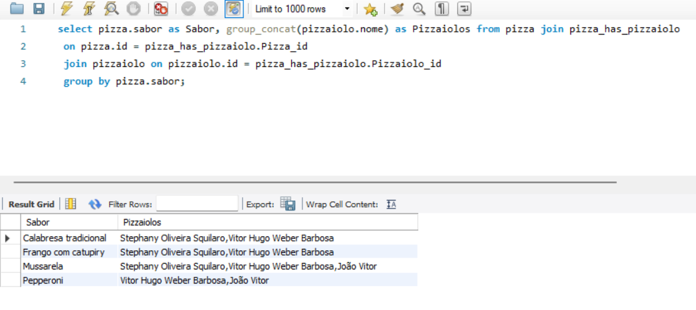
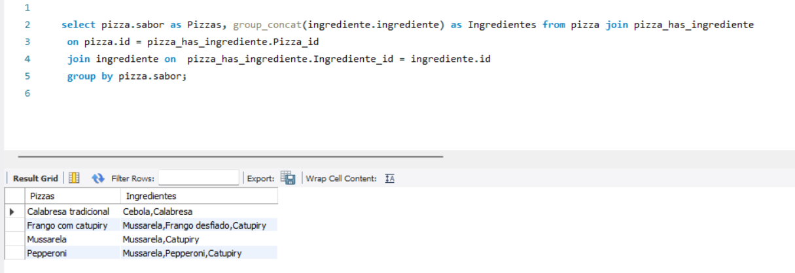
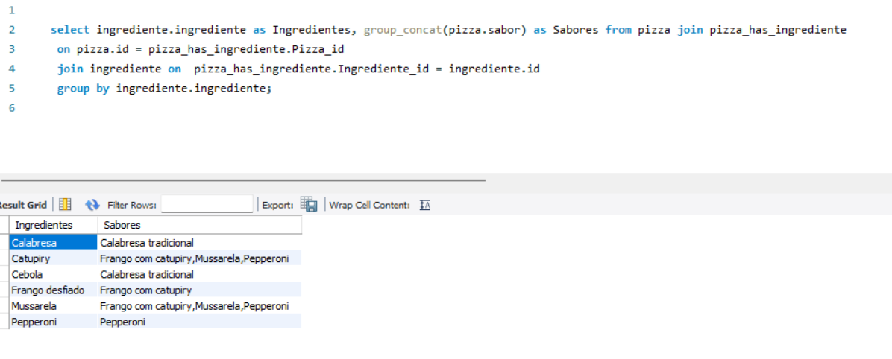

# Pizza

### Crie um relatório com todas as pizzas e os pizzaiolos aptos a produzi-las
``` sql
-- Seleciona o sabor da pizza e concatena os nomes dos pizzaiolos que a preparam.
select pizza.sabor as Sabor, group_concat(pizzaiolo.nome) as Pizzaiolos
-- Faz um join entre as tabelas pizza, pizza_has_pizzaiolo e pizzaiolo.
from pizza
join pizza_has_pizzaiolo
 on pizza.id = pizza_has_pizzaiolo.Pizza_id
 join pizzaiolo on pizzaiolo.id = pizza_has_pizzaiolo.Pizzaiolo_id
-- Agrupa os dados pelo sabor da pizza.
group by pizza.sabor;
```


### Crie um relatório com todas as pizzas e seus ingredientes
``` sql
-- Seleciona o sabor da pizza e concatena os ingredientes das pizzas que o possuem.
select pizza.sabor as Pizzas, group_concat(ingrediente.ingrediente) as Ingredientes
-- Faz um join entre as tabelas pizza, pizza_has_ingrediente e ingrediente.
from pizza
join pizza_has_ingrediente
 on pizza.id = pizza_has_ingrediente.Pizza_id
 join ingrediente on  pizza_has_ingrediente.Ingrediente_id = ingrediente.id 
-- Agrupa os dados pelo sabor da pizza.
group by pizza.sabor;
```


### Crie um relatório com todos os ingredientes e as pizzas onde são utilizados;

``` sql

-- Seleciona o ingrediente e concatena os sabores das pizzas que o contêm.
select ingrediente.ingrediente as Ingredientes, group_concat(pizza.sabor) as Sabores
-- Faz um join entre as tabelas pizza, pizza_has_ingrediente e ingrediente.
from pizza
join pizza_has_ingrediente
 on pizza.id = pizza_has_ingrediente.Pizza_id
 join ingrediente on  pizza_has_ingrediente.Ingrediente_id = ingrediente.id 
-- Agrupa os dados pelo ingrediente.
group by ingrediente.ingrediente;

```


